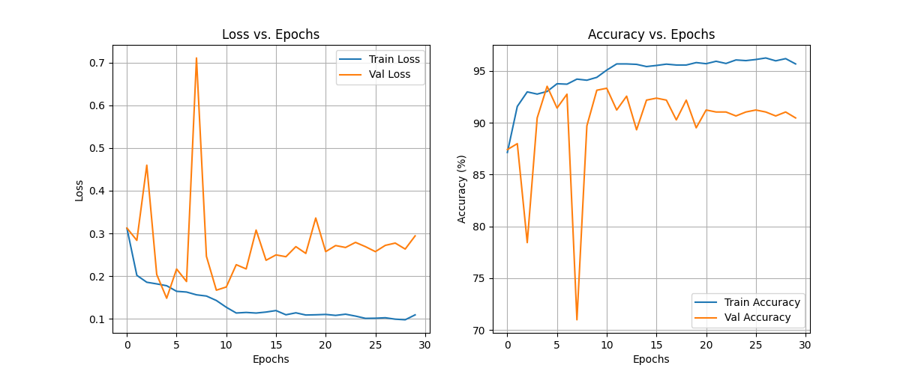
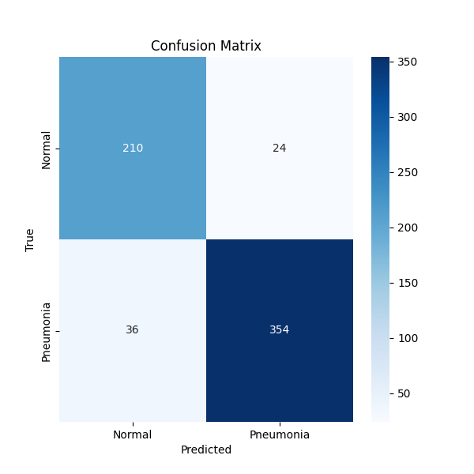
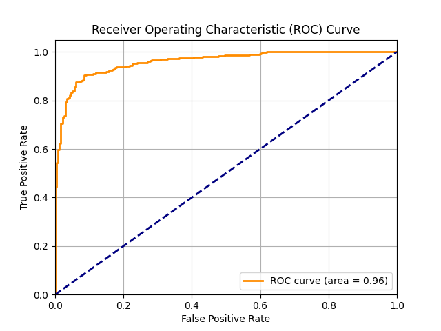

# Task 1: CNN Classification Report (Improved)

## Model Architecture
A pre-trained ResNet18 model was used. The first convolutional layer was modified to accept 1-channel grayscale images, and the final fully connected layer was adapted for 2 output classes.

## Training Methodology
- **Optimizer:** Adam (lr=0.001)
- **Loss Function:** CrossEntropyLoss
- **Epochs:** 30
- **Batch Size:** 64
- **Data Augmentation:** Random resized crop, horizontal flip, random rotation (10 degrees), random translation (10%).
- **Learning Rate Scheduler:** StepLR with a step size of 10 and a gamma of 0.1.

## Evaluation Metrics
- **Accuracy:** 0.9038
- **Precision:** 0.9365
- **Recall:** 0.9077
- **F1-score:** 0.9219
- **AUC:** 0.9605

## Visualizations
### Training Curves

### Confusion Matrix

### ROC Curve

## Failure Case Analysis
The model misclassified 60 out of 624 test images. 
(Further analysis would involve visualizing these images and investigating patterns.)
