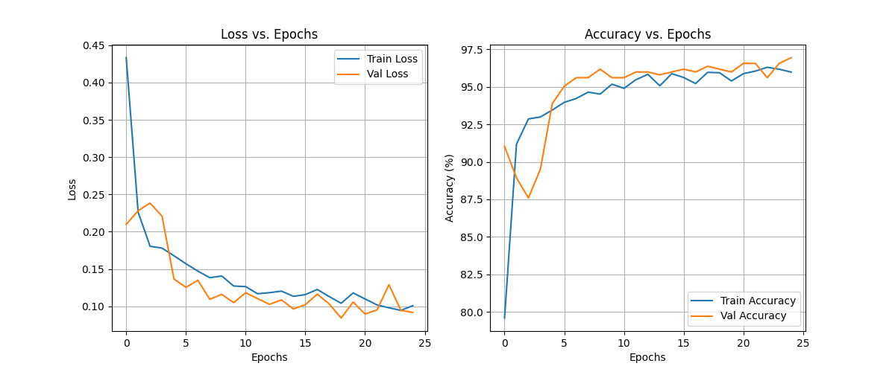
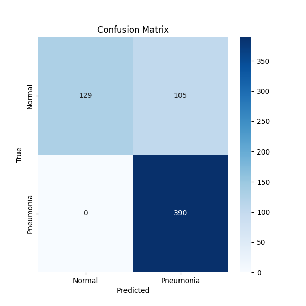
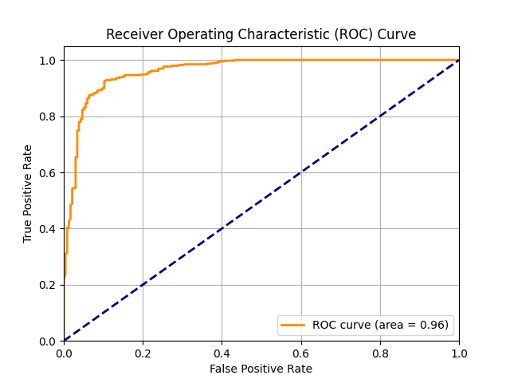

# Task 1: CNN Classification Report

## Model Architecture
A simple CNN was used with two convolutional layers, each followed by max pooling, and two fully connected layers.

## Training Methodology
- **Optimizer:** Adam (lr=0.001)
- **Loss Function:** CrossEntropyLoss
- **Epochs:** 25
- **Batch Size:** 64
- **Data Augmentation:** Random rotation (10 degrees), random translation (10%).

## Evaluation Metrics
- **Accuracy:** 0.8317
- **Precision:** 0.7879
- **Recall:** 1.0000
- **F1-score:** 0.8814
- **AUC:** 0.9607

## Visualizations
### Training Curves

### Confusion Matrix

### ROC Curve

## Failure Case Analysis
The model misclassified 105 out of 624 test images. 
(Further analysis would involve visualizing these images and investigating patterns.)
