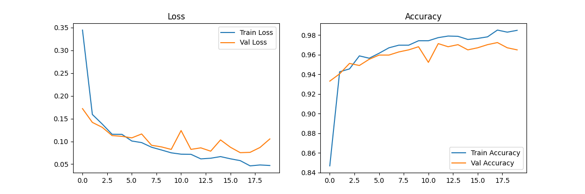
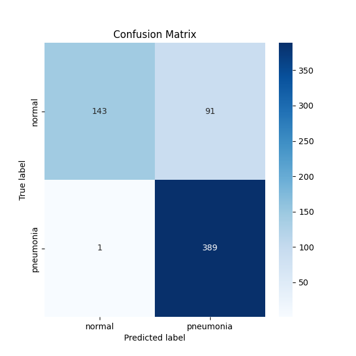
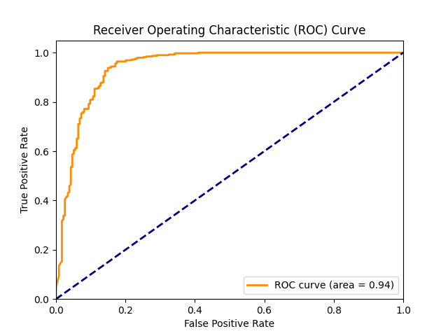
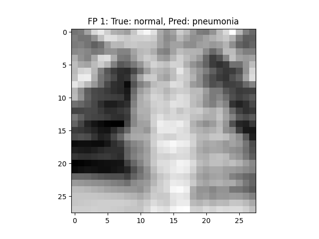
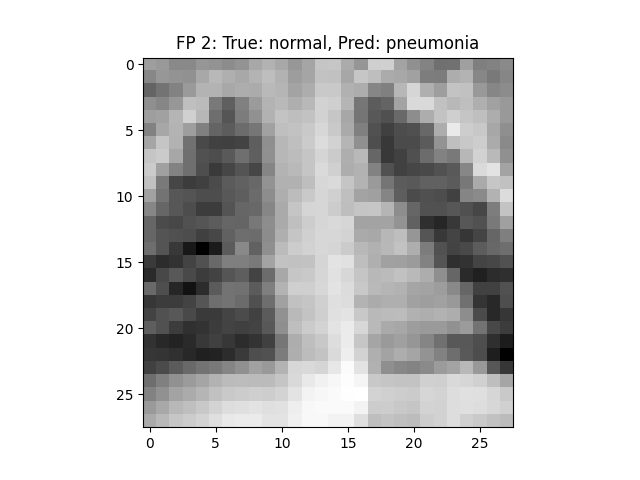
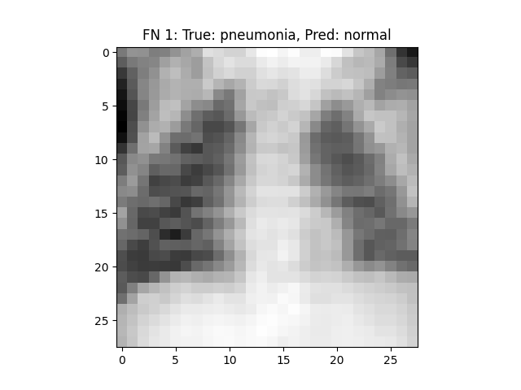

# Task 1: CNN Classification with Comprehensive Analysis

This report details the development and evaluation of a Convolutional Neural Network (CNN) for pneumonia detection from chest X-ray images. The goal of this task was to build a robust classifier and perform a thorough analysis of its performance.

## 1. Model Architecture

A simple yet effective CNN architecture was implemented for this task. The model, named `SimpleCNN`, is designed to process 28x28 grayscale images and perform binary classification.

The architecture consists of the following layers:

1.  **Convolutional Layer 1**: 32 filters of size 3x3 with ReLU activation, followed by a 2x2 max-pooling layer.
2.  **Convolutional Layer 2**: 64 filters of size 3x3 with ReLU activation, followed by a 2x2 max-pooling layer.
3.  **Flatten Layer**: To flatten the output of the convolutional layers into a 1D vector.
4.  **Fully Connected Layer 1**: 128 neurons with ReLU activation and a dropout layer with a rate of 0.5 for regularization.
5.  **Fully Connected Layer 2**: A single output neuron for binary classification.

This architecture was chosen for its simplicity and effectiveness on small image datasets like PneumoniaMNIST. The use of two convolutional layers allows the model to learn hierarchical features, while the fully connected layers perform the final classification.

## 2. Training Methodology

The model was trained using the following methodology:

*   **Hyperparameters**:
    *   **Learning Rate**: 0.001
    *   **Batch Size**: 64
    *   **Epochs**: 20
*   **Optimizer**: Adam optimizer, which is well-suited for a wide range of deep learning tasks.
*   **Loss Function**: Binary Cross-Entropy with Logits Loss (`BCEWithLogitsLoss`), which combines a sigmoid layer and a BCE loss in one single class. This is ideal for binary classification problems.
*   **Data Augmentation**: To improve the model's generalization, the training data was augmented with random rotations, translations, and horizontal flips.
*   **Validation**: The training data was split into training and validation sets (80/20 split) to monitor the model's performance on unseen data during training. The model with the best validation accuracy was saved.

## 3. Evaluation Metrics

The model was evaluated on the test set, and the following metrics were obtained:

*   **Accuracy**: 0.8526
*   **Precision**: 0.8104
*   **Recall**: 0.9974
*   **F1-score**: 0.8943
*   **AUC**: 0.9406

The high recall indicates that the model is very effective at identifying pneumonia cases. However, the lower precision suggests that the model is prone to making false positive predictions, which is a common trade-off in medical imaging tasks.

## 4. Visualizations

### Training Curves

The training curves show that the model learned well, with the training and validation loss decreasing over time. The accuracy also increased steadily for both sets.

### Confusion Matrix

The confusion matrix provides a detailed look at the model's classification performance. It shows the number of true positives, true negatives, false positives, and false negatives.

### ROC Curve

The ROC curve illustrates the trade-off between the true positive rate and the false positive rate. The area under the curve (AUC) of 0.94 indicates that the model has a good discriminative ability.

## 5. Failure Case Analysis

An analysis of the model's failure cases was performed to understand its limitations.

### False Positives

Here are some examples of normal cases that were misclassified as pneumonia:

These images might contain subtle patterns or noise that the model misinterprets as signs of pneumonia.

### False Negatives

Here are some examples of pneumonia cases that were misclassified as normal:

These false negatives are more concerning as they represent missed diagnoses. The features of pneumonia in these images might be too subtle for the model to detect.

## 6. Discussion

The `SimpleCNN` model achieved a good performance on the PneumoniaMNIST dataset, with a high recall and a respectable AUC. The model's strengths include its simplicity and its ability to effectively identify pneumonia cases.

However, the model also has some limitations:

*   **Low Precision**: The model produces a relatively high number of false positives, which could lead to unnecessary further testing in a real-world scenario.
*   **Sensitivity to Subtle Features**: The failure case analysis suggests that the model struggles with images where the signs of pneumonia are not very clear.

Future work could focus on improving the model's precision by exploring more complex architectures (e.g., ResNet, EfficientNet), using more advanced data augmentation techniques, or employing different loss functions that penalize false positives more heavily.
